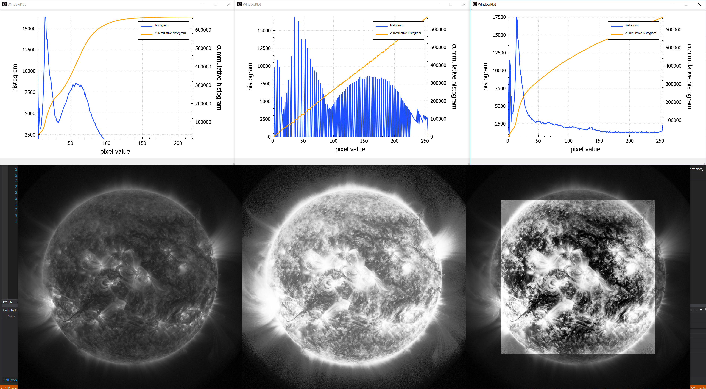
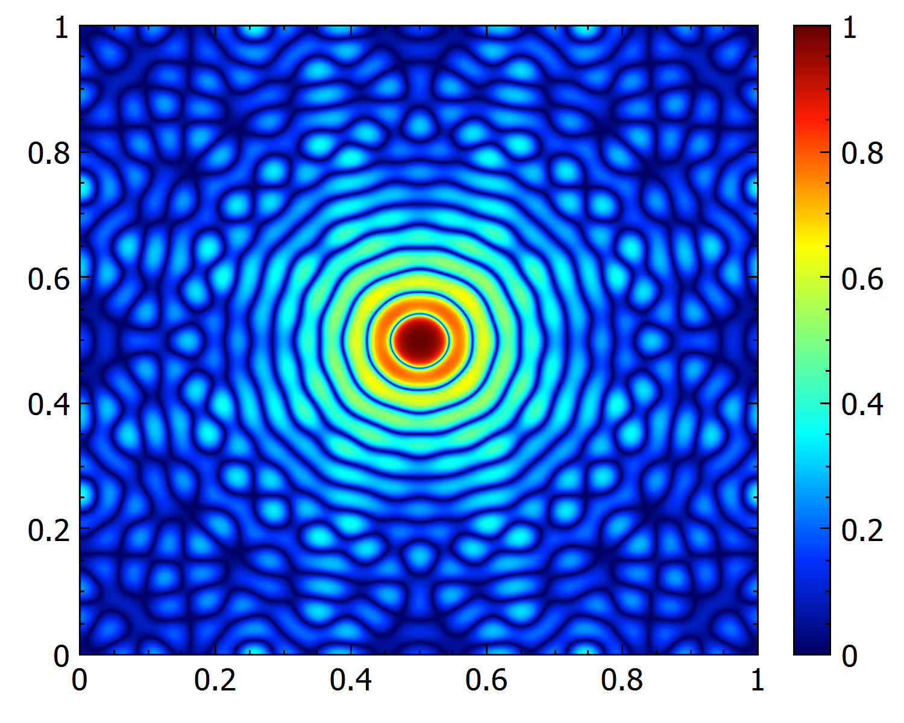
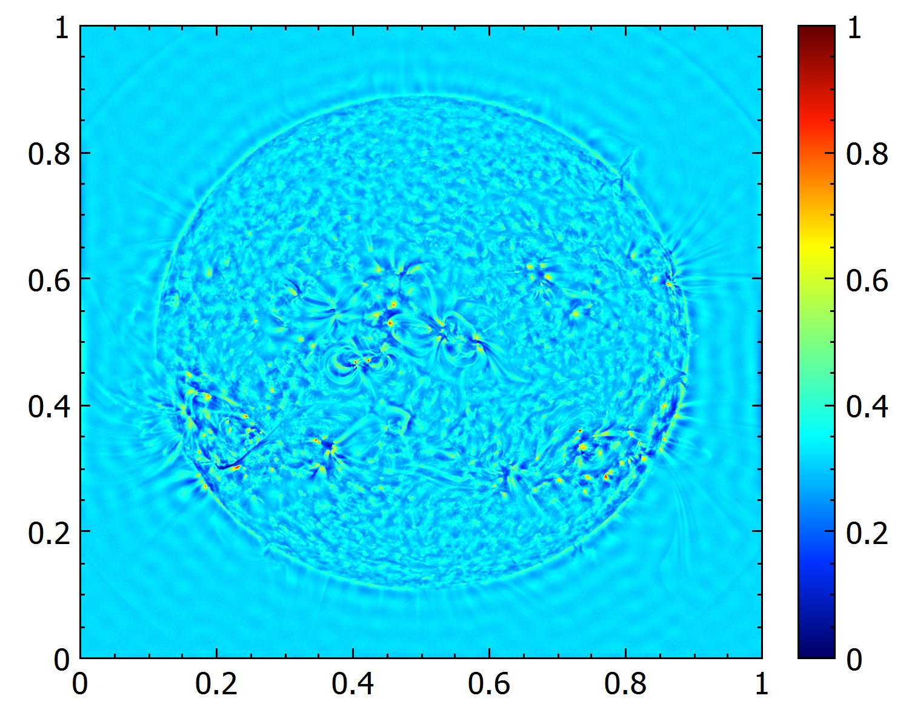
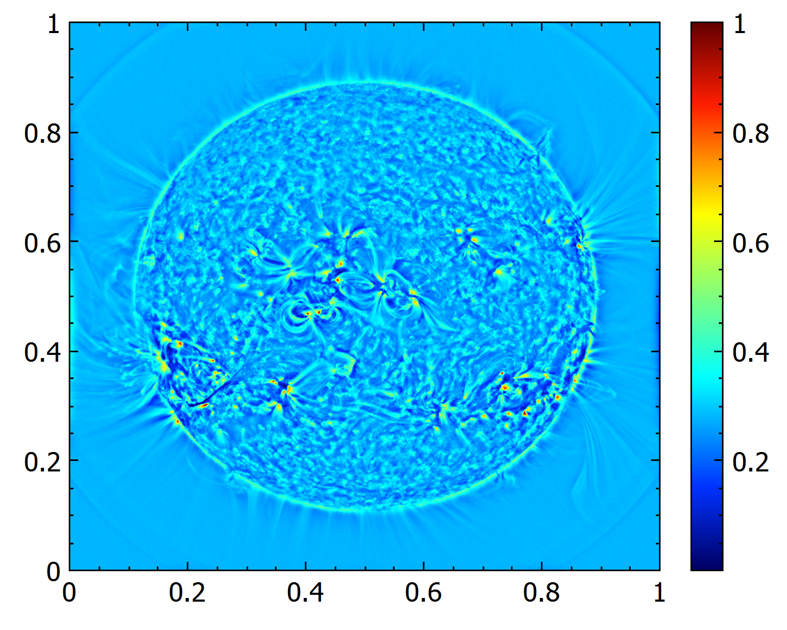
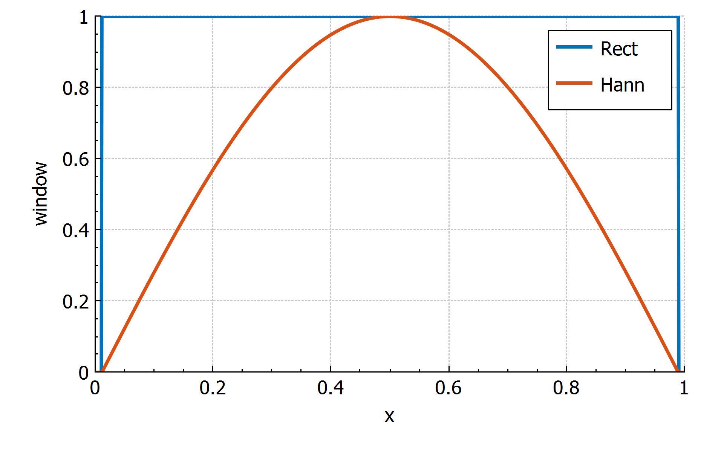
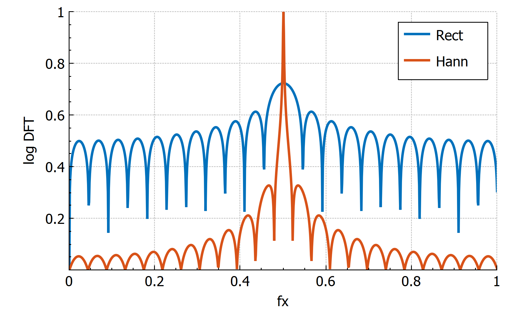
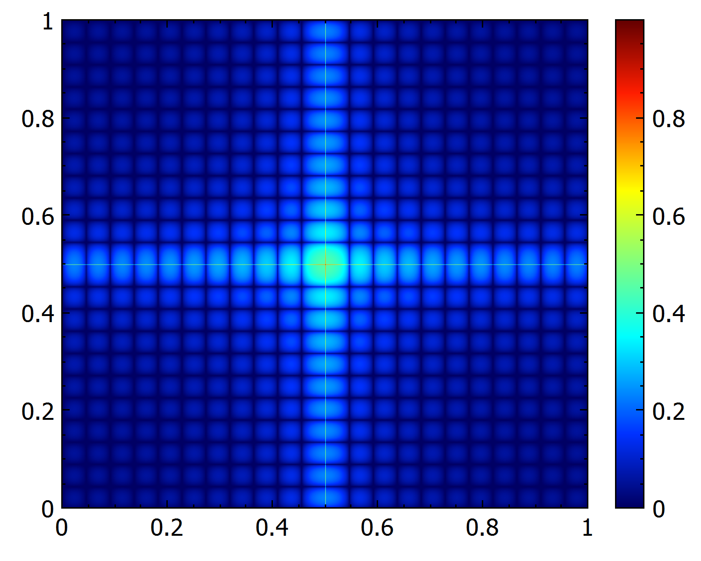
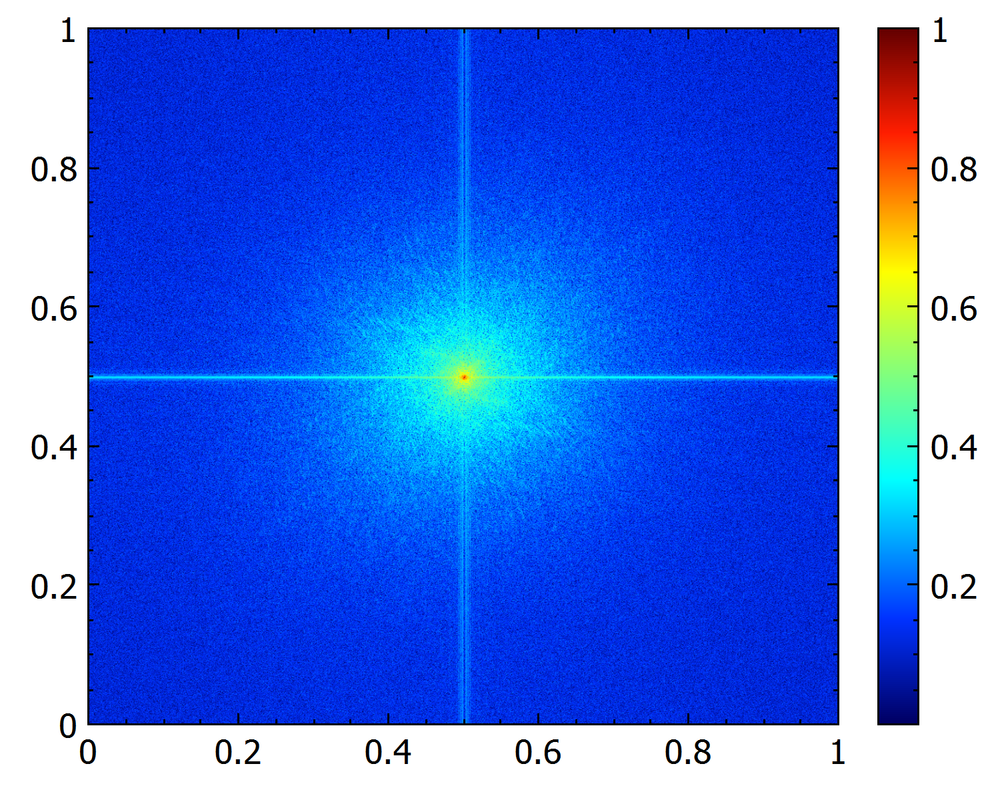
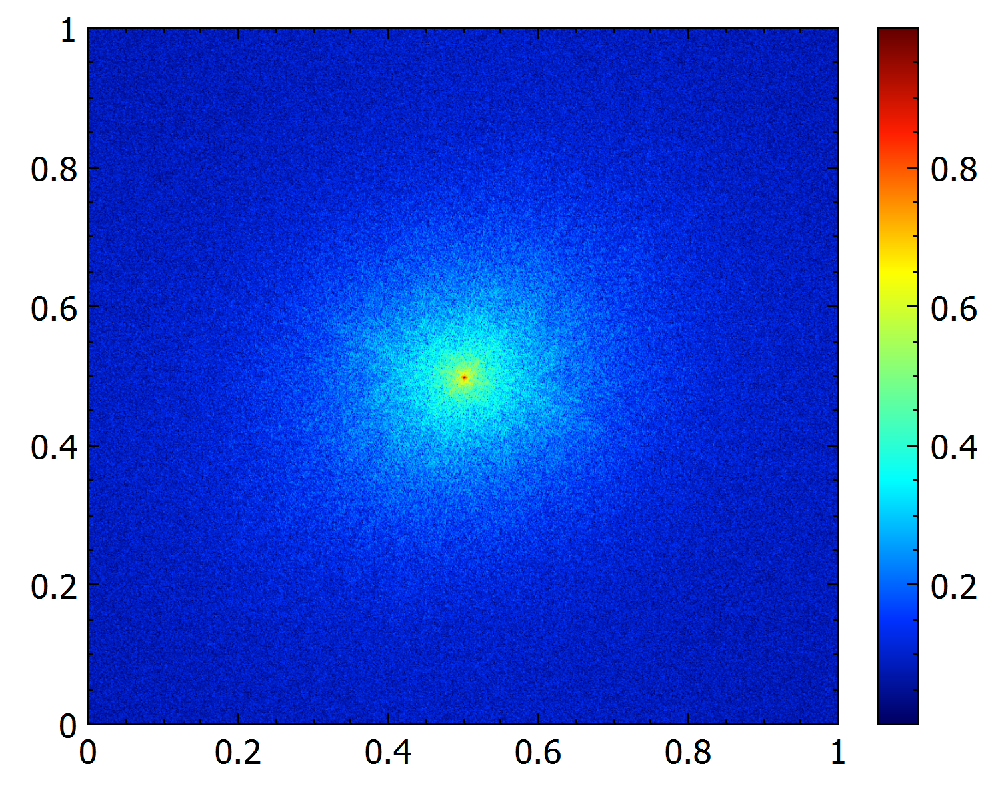

# Zdeny's shenanigans
Zdenek Hrazdira, 2019 / 2020 / 2021

Semi-random PhD funky stuff. Mainly contains calculations for astrophysics articles I worked on - [Solar Dynamics Observatory](https://sdo.gsfc.nasa.gov/) image processing, image registration, also non-convex optimization, fractals. With Qt GUI, #uses STL, OpenCV, OpenMP, fftw, QCustomPlot, spdlog, cuda. ***Examples below.***

### Article links
- [Iterative Phase Correlation Algorithm for High-precision Subpixel Image Registration](https://iopscience.iop.org/article/10.3847/1538-4365/ab63d7)
- [Measuring Solar Differential Rotation with an Iterative Phase Correlation Method](https://iopscience.iop.org/article/10.3847/1538-4365/abc702)

### The Qt GUI

### Visualization of optimizer progress on a given objective function landscape

### Adaptive histogram equalization

### Convolution theorem aware frequency domain image filtering
  

### Modeling of the windowing effect on the Discrete Fourier transform
 
    
