# Zdeny's shenanigans

Semi-random PhD funky stuff. Mainly contains calculations for astrophysics articles I worked on - [Solar Dynamics Observatory](https://www.nasa.gov/mission_pages/sdo/main/index.html) image processing, image registration, also non-convex optimization, fractals. With [Qt5 GUI](https://www.qt.io/), #uses [C++17](https://en.cppreference.com/w/cpp/17), [OpenCV](https://opencv.org/), [OpenMP](https://www.openmp.org/), [fmt](https://fmt.dev/latest/index.html), [QCustomPlot](https://www.qcustomplot.com/), [spdlog](https://github.com/gabime/spdlog), [CUDA](https://developer.nvidia.com/cuda-toolkit). ***Examples below.***

## Article links
- 📄 [Iterative Phase Correlation Algorithm for High-precision Subpixel Image Registration](https://iopscience.iop.org/article/10.3847/1538-4365/ab63d7)
- 📄 [Measuring Solar Differential Rotation with an Iterative Phase Correlation Method](https://iopscience.iop.org/article/10.3847/1538-4365/abc702)

## Subpixel [image registration](https://en.wikipedia.org/wiki/Image_registration) via [Iterative Phase Correlation](https://iopscience.iop.org/article/10.3847/1538-4365/ab63d7) (gradual 1 pixel shift via [bilinear interpolation](https://en.wikipedia.org/wiki/Bilinear_interpolation) of a 256x256 image, no noise vs heavy noise)
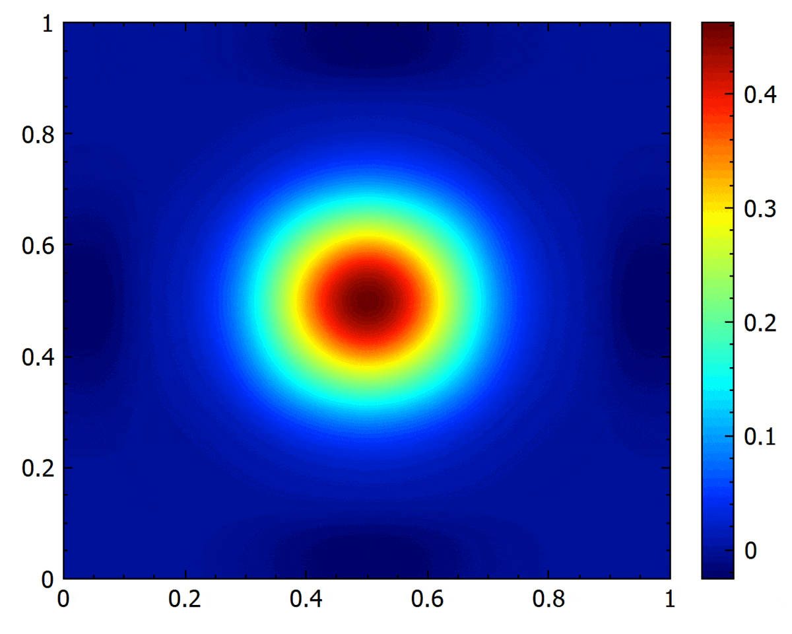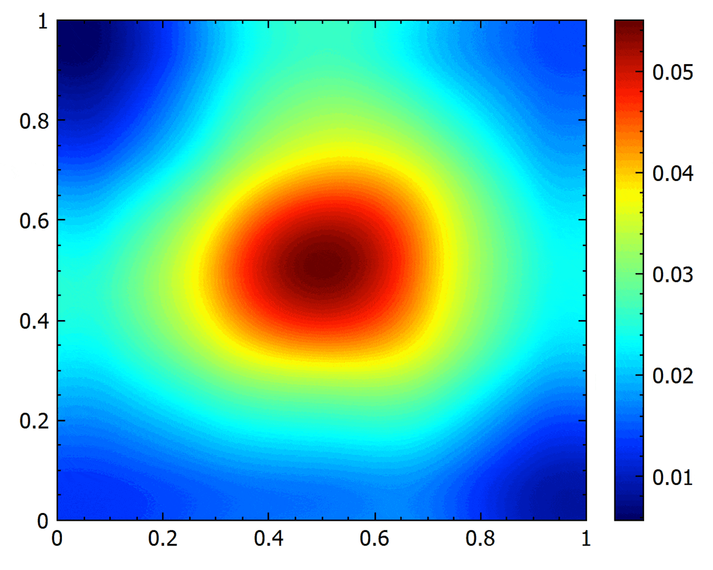

## [Solar photosphere](https://en.wikipedia.org/wiki/Photosphere) [differential rotation](https://en.wikipedia.org/wiki/Differential_rotation) measurements from [SDO/HMI](http://hmi.stanford.edu/) continuum images

&nbsp; &nbsp; &nbsp; &nbsp; &nbsp;

## The [Qt5](https://www.qt.io/) GUI
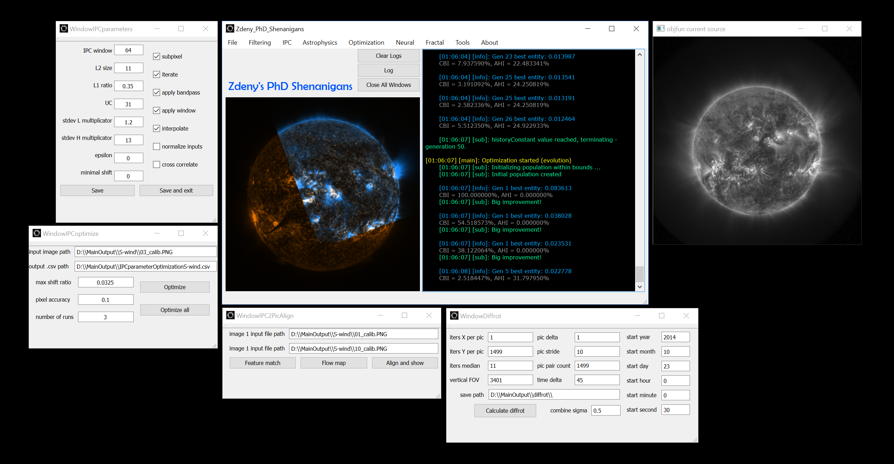

## Visualization of [optimizer](https://en.wikipedia.org/wiki/Mathematical_optimization) progress on a given objective function landscape
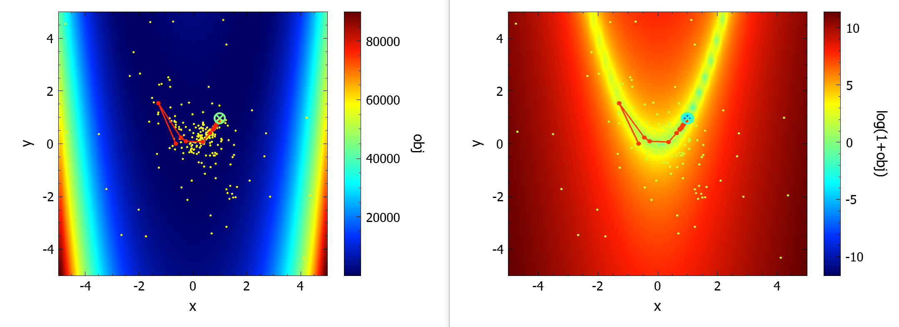

## Visualization of *meta*-[optimizer](https://en.wikipedia.org/wiki/Mathematical_optimization) progress and optimization improvement on a given *meta*-objective function landscape
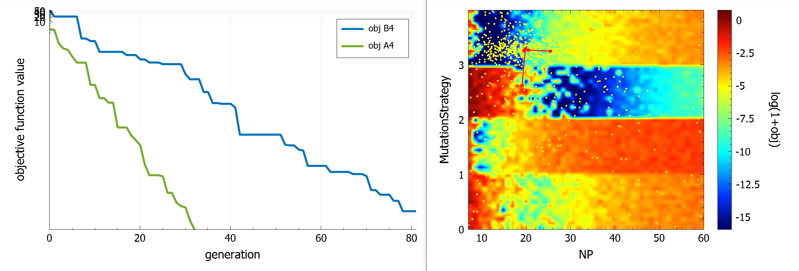

## Adaptive [histogram equalization](https://en.wikipedia.org/wiki/Adaptive_histogram_equalization)

## [Convolution theorem](https://en.wikipedia.org/wiki/Convolution_theorem) aware frequency domain image filtering
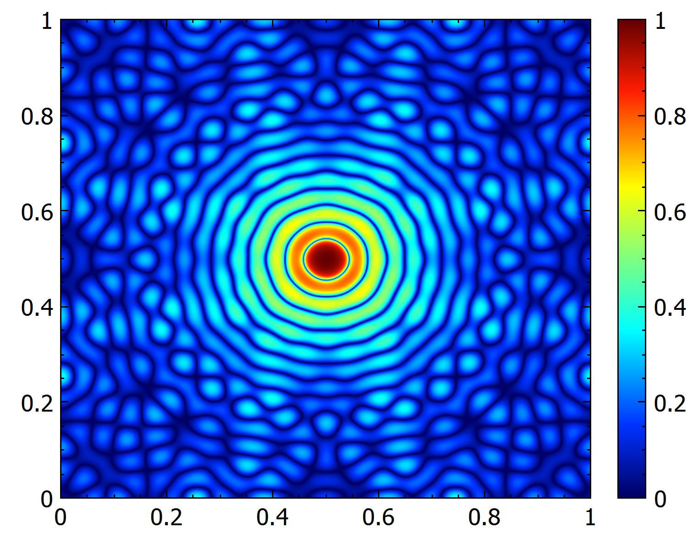 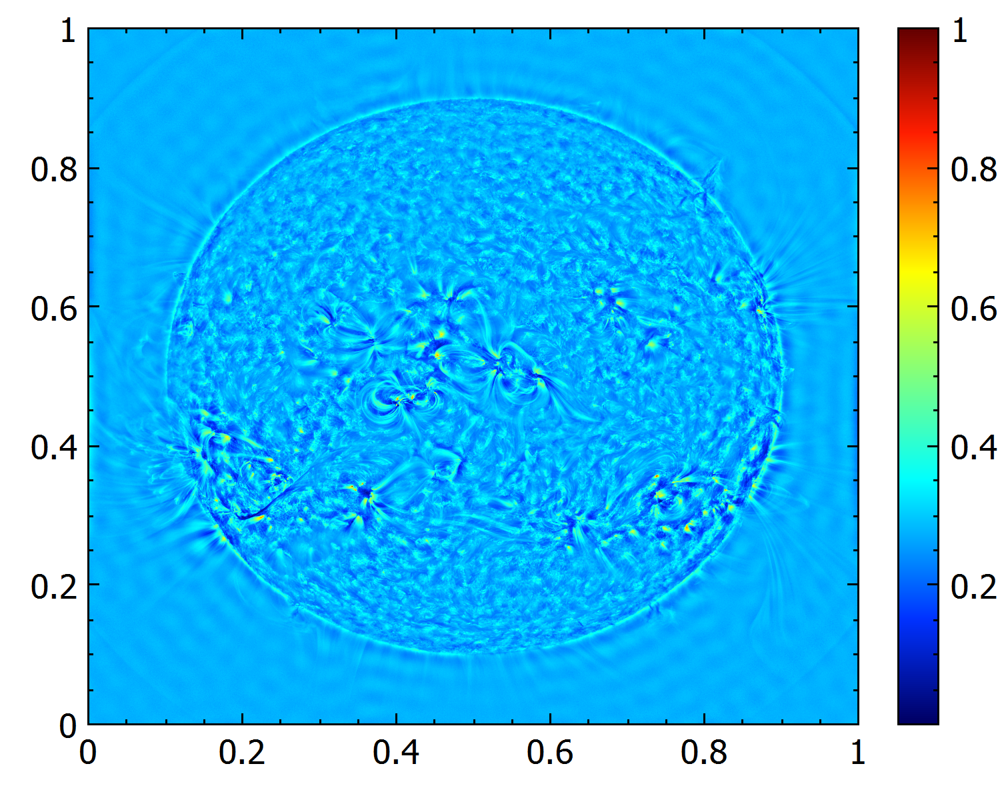 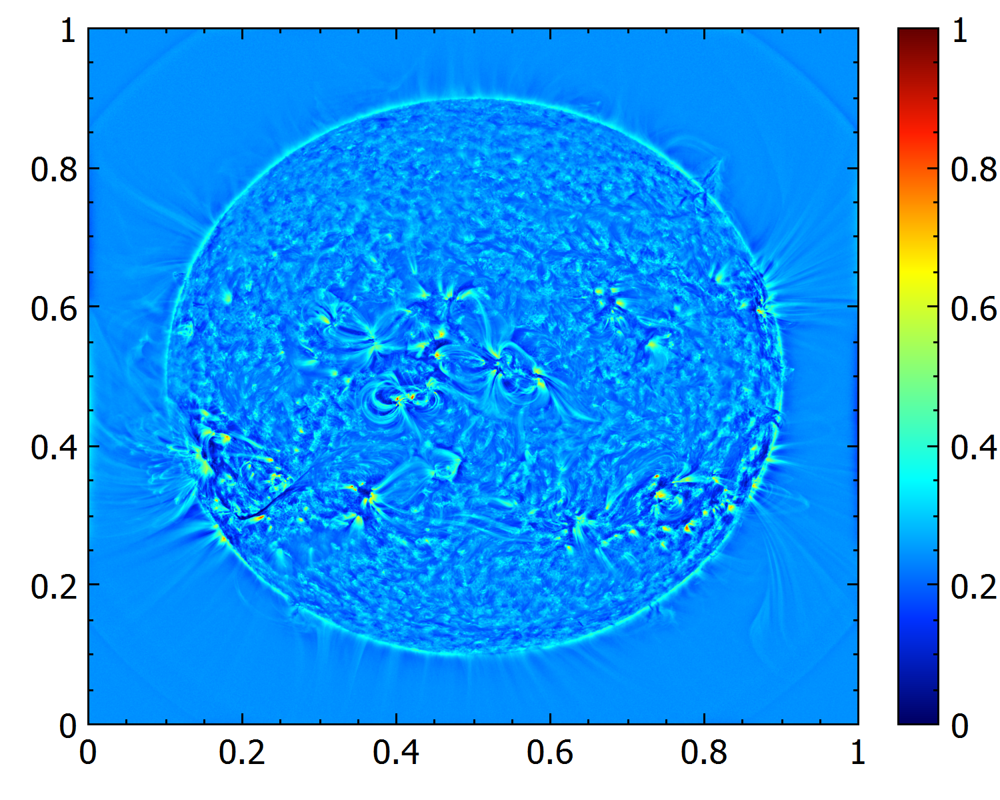

## Modeling of the [windowing effect](https://en.wikipedia.org/wiki/Window_function) on the [Discrete Fourier transform](https://en.wikipedia.org/wiki/Discrete_Fourier_transform)
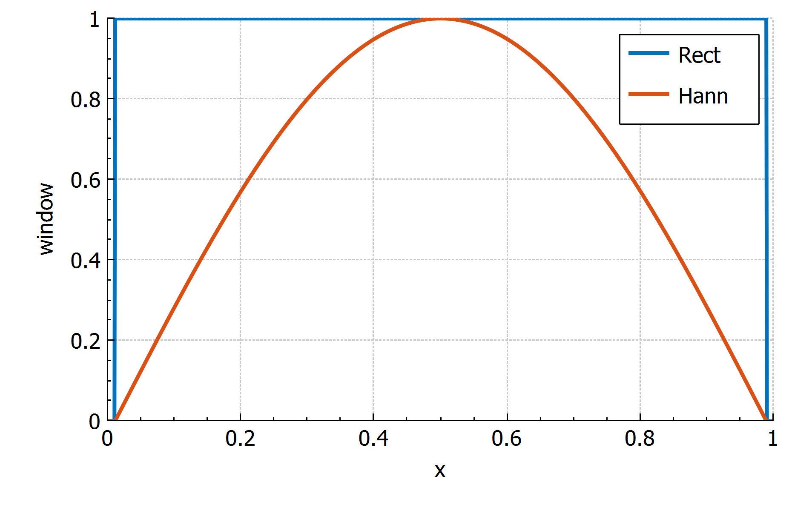 
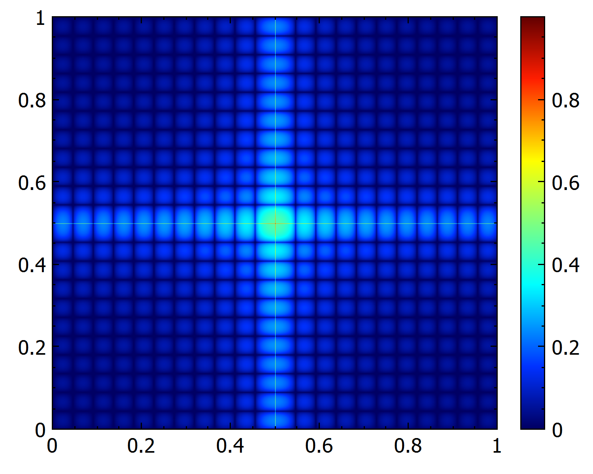 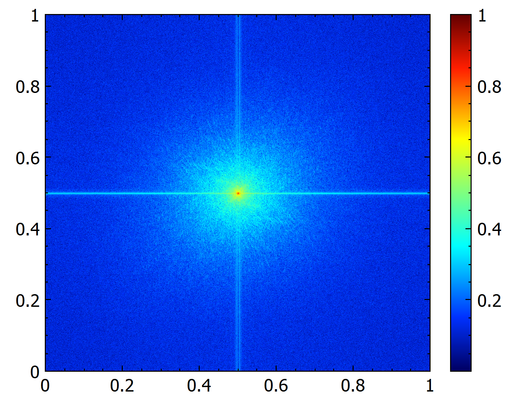   
