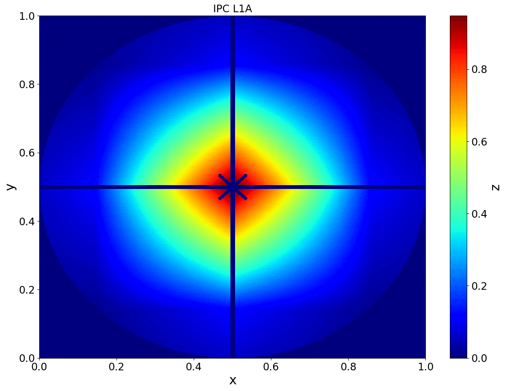
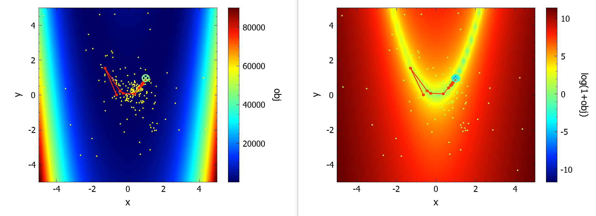
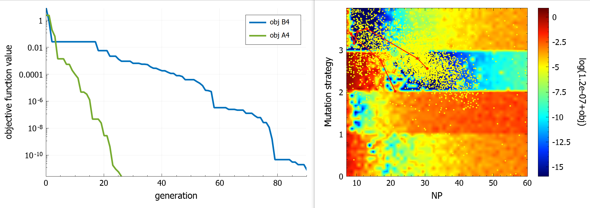
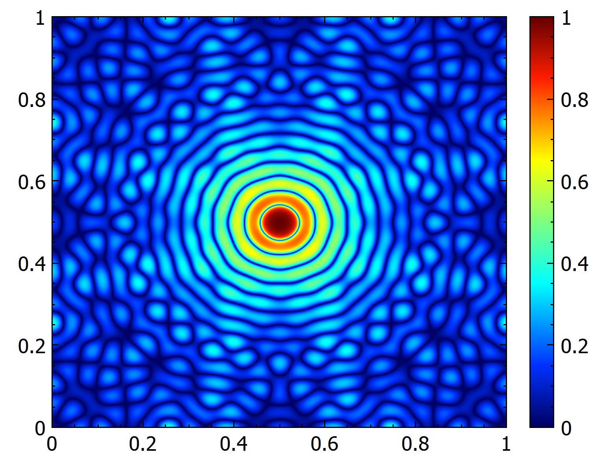
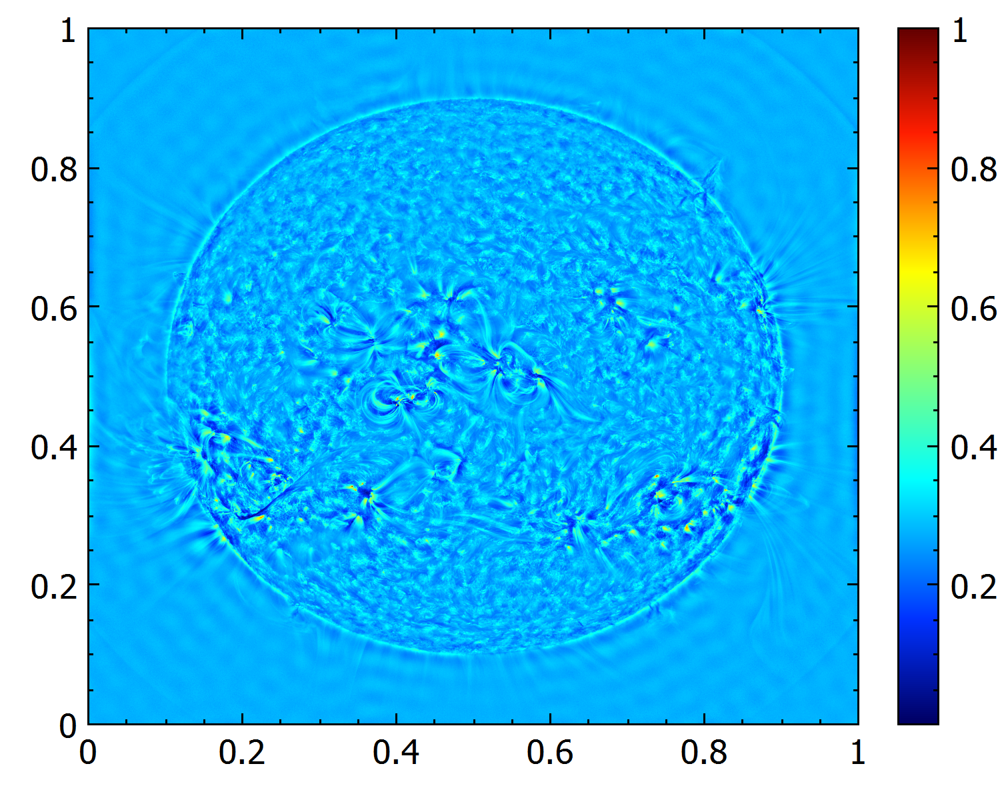
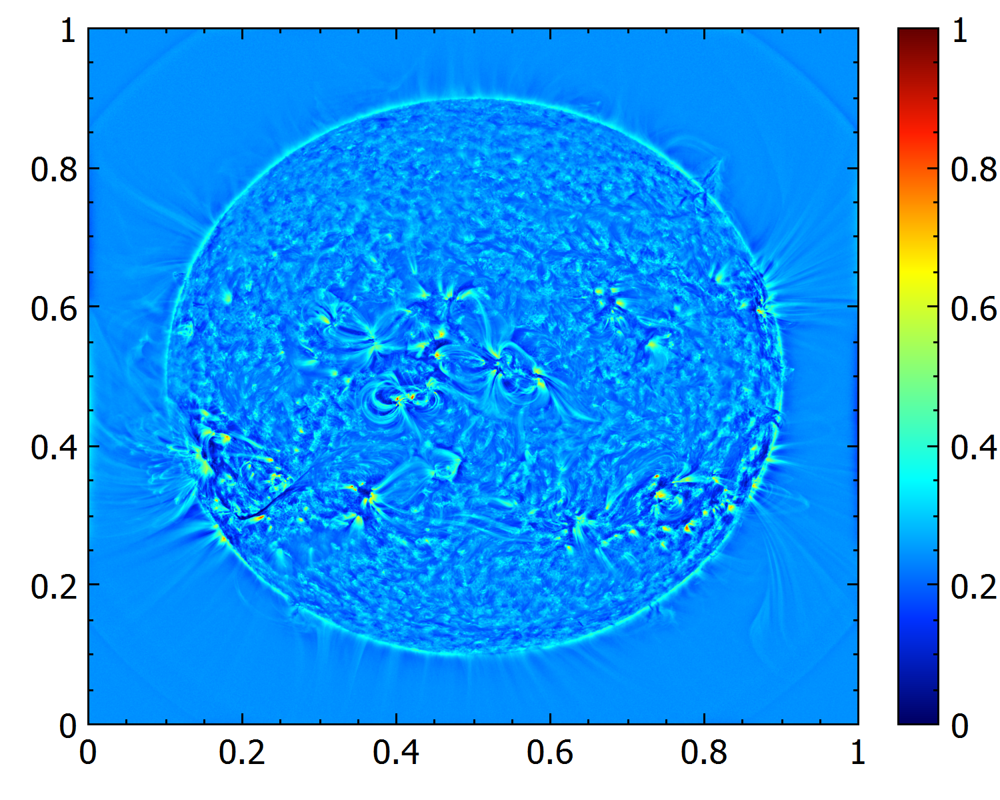
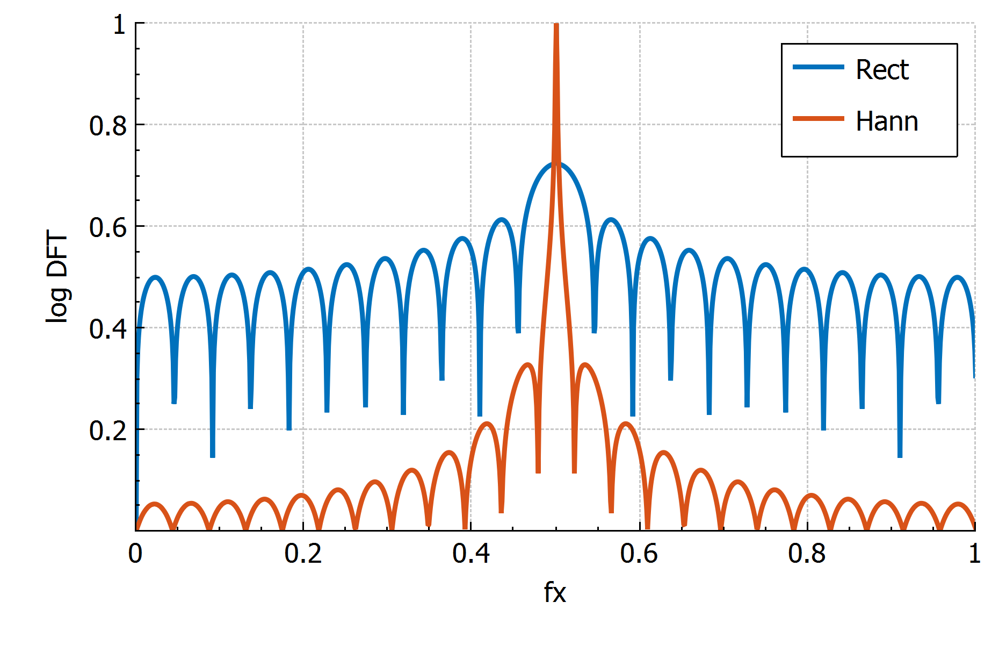
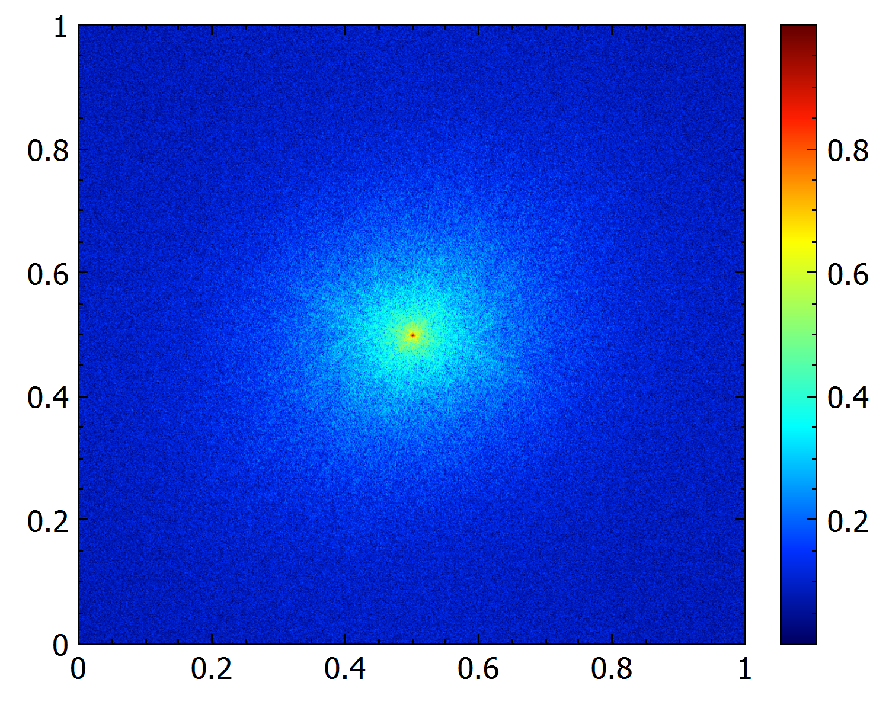
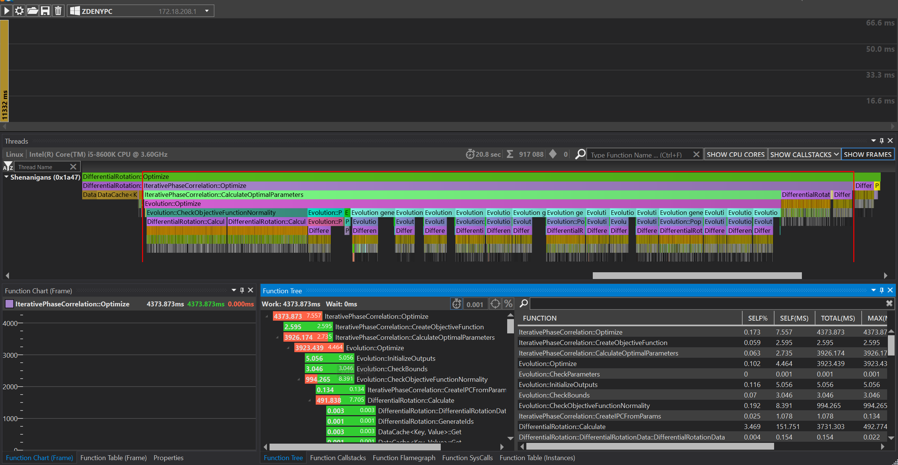

# Zdeny's shenanigans 🪐

 

 

 

Semi-random funky stuff, mainly for my PhD. Contains calculations and algorithm implementations for various applied mathematics / astrophysics articles I worked on - [Solar Dynamics Observatory](https://www.nasa.gov/mission_pages/sdo/main/index.html) image processing, image registration, non-convex optimization. With C++ [ImGui](https://github.com/ocornut/imgui) GUI, #uses [C++20](https://en.cppreference.com/w/cpp/20), [OpenCV](https://opencv.org/), [OpenMP](https://www.openmp.org/), [CUDA](https://developer.nvidia.com/cuda-toolkit), [Matplotlib](https://matplotlib.org/), [torch](https://pytorch.org/), [astropy](https://github.com/astropy/astropy), [spdlog](https://github.com/gabime/spdlog), [flamegraph](https://github.com/brendangregg/FlameGraph), [fmt](https://fmt.dev/latest/index.html), [googletest](https://github.com/google/googletest), [json](https://github.com/nlohmann/json), [optick](https://github.com/bombomby/optick), [pybind11](https://github.com/pybind/pybind11), [QCustomPlot](https://www.qcustomplot.com/), [tracy](https://github.com/wolfpld/tracy), [glad](https://glad.dav1d.de/), [GLFW](https://www.glfw.org/), [ImGui](https://github.com/ocornut/imgui). ***Examples below.***

## Article links
- 📌 [Iterative Phase Correlation Algorithm for High-precision Subpixel Image Registration](https://iopscience.iop.org/article/10.3847/1538-4365/ab63d7)
- 🪐 [Measuring Solar Differential Rotation with an Iterative Phase Correlation Method](https://iopscience.iop.org/article/10.3847/1538-4365/abc702)

## The [ImGui](https://github.com/ocornut/imgui/) GUI

## Subpixel [image registration](https://en.wikipedia.org/wiki/Image_registration) via [Iterative Phase Correlation](https://iopscience.iop.org/article/10.3847/1538-4365/ab63d7) - gradual 2px shift via [bilinear interpolation](https://en.wikipedia.org/wiki/Bilinear_interpolation) of a 128x128 image (standard vs [IPC](https://iopscience.iop.org/article/10.3847/1538-4365/ab63d7))

## [Solar photosphere](https://en.wikipedia.org/wiki/Photosphere) [differential rotation](https://en.wikipedia.org/wiki/Differential_rotation) measurements from [SDO/HMI](http://hmi.stanford.edu/) continuum images

&nbsp; &nbsp; &nbsp; &nbsp; &nbsp;

## Visualization of [optimizer](https://en.wikipedia.org/wiki/Mathematical_optimization) progress on a given objective function landscape

## Visualization of *meta*-[optimizer](https://en.wikipedia.org/wiki/Mathematical_optimization) progress and optimization improvement on a given *meta*-objective function landscape

## Adaptive [histogram equalization](https://en.wikipedia.org/wiki/Adaptive_histogram_equalization)

## [Convolution theorem](https://en.wikipedia.org/wiki/Convolution_theorem) aware frequency domain image filtering
  

## Modeling of the [windowing effect](https://en.wikipedia.org/wiki/Window_function) on the [Discrete Fourier transform](https://en.wikipedia.org/wiki/Discrete_Fourier_transform)
 
   

## Profiling
### Profiling with [Valgrind](https://valgrind.org/) / [Callgrind](https://valgrind.org/docs/manual/cl-manual.html) / [Kcachegrind](http://kcachegrind.sourceforge.net/html/Documentation.html)
- run `./script/perf/kcachegrind.sh`

### Profiling with [Optick](https://github.com/bombomby/optick)
- run the app with `ENABLE_PROFILING` defined
- trace file is created when app terminates
- run the Optick GUI app (only on Windows) and import the trace file from `build/`

### Profiling with [Tracy](https://github.com/wolfpld/tracy)
- install the required libraries `sudo apt-get -y install libglfw3-dev libgtk-3-dev libcapstone-dev libtbb-dev`
- build the profiler via `make release -j12` in `./libs/tracy/profiler/build/unix/`
- run the app with `ENABLE_PROFILING` defined
- run `script/perf/tracy.sh` or `./libs/tracy/profiler/build/unix/Tracy-release` and click connect
- save the trace file if needed

