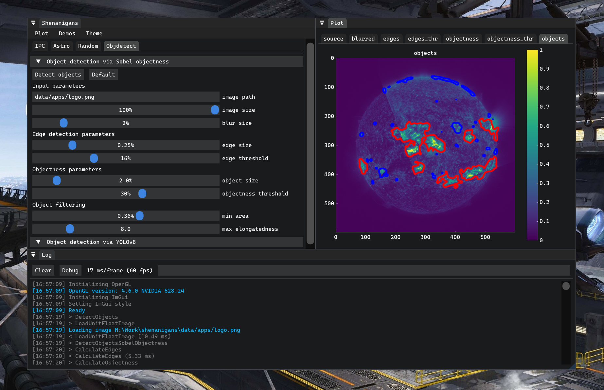
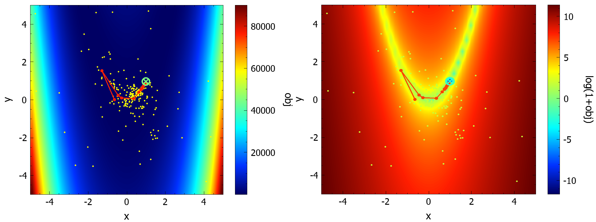

# Zdeny's shenanigans 🪐

 

 

 

 

Semi-random ***funky stuff***, mainly for my [PhD experiments](https://www.vut.cz/www_base/zav_prace_soubor_verejne.php?file_id=250739) and [articles](#article-links). Contains calculations and algorithm implementations for various applied mathematics and astrophysics articles I worked on - [Solar Dynamics Observatory](https://www.nasa.gov/mission_pages/sdo/main/index.html) image processing, sub-pixel [image registration](https://en.wikipedia.org/wiki/Image_registration), non-convex [optimization](https://en.wikipedia.org/wiki/Mathematical_optimization).
Written in [C++20](https://en.cppreference.com/w/cpp/20), with C++ [ImGui](https://github.com/ocornut/imgui) GUI and [ImPlot](https://github.com/epezent/implot) / [pybind11](https://github.com/pybind/pybind11)+[matplotlib](https://matplotlib.org/) plots. Uses [OpenCV](https://opencv.org/), [OpenMP](https://www.openmp.org/), [OpenGL](https://www.opengl.org/), [cuda](https://developer.nvidia.com/cuda-toolkit), [matplotlib](https://matplotlib.org/), [torch](https://pytorch.org/), [astropy](https://github.com/astropy/astropy), [spdlog](https://github.com/gabime/spdlog), [flamegraph](https://github.com/brendangregg/FlameGraph), [fmt](https://fmt.dev/latest/index.html), [googletest](https://github.com/google/googletest), [json](https://github.com/nlohmann/json), [optick](https://github.com/bombomby/optick), [pybind11](https://github.com/pybind/pybind11), [QCustomPlot](https://www.qcustomplot.com/), [tracy](https://github.com/wolfpld/tracy), [glad](https://glad.dav1d.de/), [GLFW](https://www.glfw.org/), [ImGui](https://github.com/ocornut/imgui), and others. ***Examples below.***

## 📃Article links
- 📌 [Iterative Phase Correlation Algorithm for High-precision Subpixel Image Registration](https://iopscience.iop.org/article/10.3847/1538-4365/ab63d7)
- 🪐 [Measuring Solar Differential Rotation with an Iterative Phase Correlation Method](https://iopscience.iop.org/article/10.3847/1538-4365/abc702)

## 🚀The [ImGui](https://github.com/ocornut/imgui/)+[ImPlot](https://github.com/epezent/implot) GUI

## 🔎Subpixel shift / rotation / scale [image registration](https://en.wikipedia.org/wiki/Image_registration) of dissimilar images via [Iterative Phase Correlation](https://iopscience.iop.org/article/10.3847/1538-4365/ab63d7)

## ☀️[Solar photosphere](https://en.wikipedia.org/wiki/Photosphere) [differential rotation](https://en.wikipedia.org/wiki/Differential_rotation) measurements from [SDO/HMI](http://hmi.stanford.edu/) continuum images

## 📉Visualization of [optimizer](https://en.wikipedia.org/wiki/Mathematical_optimization) progress on a given objective function landscape

## 📈Visualization of *meta*-[optimizer](https://en.wikipedia.org/wiki/Mathematical_optimization) progress and optimization improvement on a given *meta*-objective function landscape

## 📊Adaptive [histogram equalization](https://en.wikipedia.org/wiki/Adaptive_histogram_equalization)

## ⌚Profiling with [Tracy](https://github.com/wolfpld/tracy)
- install the required libraries `sudo apt -y install libglfw3-dev libgtk-3-dev libcapstone-dev libtbb-dev`
- build the profiler via `make release -j12` in `./libs/tracy/profiler/build/unix/`
- run the app with `ENABLE_PROFILING` defined
- run `script/perf/tracy.sh` or `./libs/tracy/profiler/build/unix/Tracy-release` and click connect
- save the trace file if needed

